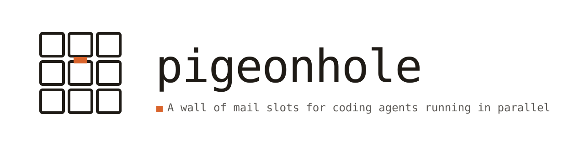

<picture>
  <source media="(prefers-color-scheme: dark)" srcset="assets/banner-dark.svg">
  <source media="(prefers-color-scheme: light)" srcset="assets/banner-light.svg">
  
</picture>

---

If you run several agents at once, one per git worktree, they can't see each other. Two of them refactor the same shared module, and you find out at rebase. pigeonhole gives each worktree a mail slot: agents post what they're working on, and leave each other notes when something they changed will break someone else.

There is no server, no daemon and no MCP. It is one POSIX shell script and the filesystem.

## Install

**Claude Code:**

```
/plugin marketplace add Baukebrenninkmeijer/pigeonhole
/plugin install pigeonhole@pigeonhole
```

That's it. The plugin registers the skill and the `SessionStart` hook. Nothing to add to `settings.json`, nothing to symlink.

**Any [Agent Plugins](https://agent-plugins.org/) client:** install the repo as a plugin however your client does it. You get the skill; you do not get the hook, because hooks are not part of the portable spec. Have your agent run `pigeonhole join` once per session instead. `AGENTS.md` at the repo root says so in the form an agent will follow.

The two formats coexist in one repo rather than one being generated from the other:

| | Agent Plugins 1.0.0 | Claude Code |
|---|---|---|
| Manifest | `plugin.json` (root) | `.claude-plugin/plugin.json` |
| Marketplace | n/a | `.claude-plugin/marketplace.json` |
| Skills | `skills/pigeonhole/SKILL.md` | same file |
| Hooks | client extension, not portable | `hooks/hooks.json` |

The skill is the one both specs agree on, so it exists once and is never copied.

## What an agent sees

At session start:

```
pigeonhole: you are 'api-dubai'. 1 unread message(s). Invoke the pigeonhole
skill to read and archive them before starting work. Live agents:
web-osaka: PROJ-812 reworking auth in shared/auth.py; api-seville;
billing-accra-v2: bumping the SDK to 4.2
```

Two things in one line: mail is waiting, and someone else is already in `shared/auth.py`.

## Commands

```bash
PG="$HOME/.pigeonhole/bin/pigeonhole"

"$PG" board                  # who's live and what each is working on
echo "PROJ-812: auth rework" | "$PG" status
"$PG" check                  # unread message paths
echo "renamed .token to .access_token" | "$PG" send web-castries
"$PG" archive <path>         # after you've acted on it
```

`whoami`, `join`, `peers` and `sweep` also exist; under Claude Code the hook handles the last three.

When something looks wrong:

```bash
"$PG" doctor
```

Prints where the script and store actually are, whether the symlink is current, who it thinks you are, your unread count, and how many mailboxes are live, stale, or retired. Exits nonzero if any of it looks broken. Most problems in a system like this are invisible until someone checks by hand, so this checks by hand for you.

## How it works

```
$HOME/.pigeonhole/
  bin/pigeonhole                        # symlink the hook keeps current
  mail/
    <repo>-<workspace>/                 # one directory per agent = the roster
      20260815-123857-…-web-osaka.md   # unread
      read/                             # archived; deleted after 30 days
      .joined                           # liveness
      .status                           # one line: what this agent is doing
    .retired/                           # not joined in 30 days
```

A directory existing is what makes an agent addressable. There's no roster file to keep in sync. Identity is `<repo>-<workspace>`, derived from the git common dir and the worktree root, so it's stable no matter which subdirectory a command runs from, and unique across repos that reuse workspace names.

The store is global, not per-repo. A change in one repo routinely breaks a consumer in another, and that message needs to arrive.

## Design notes

Delivery is pull-based. A message lands when the recipient's next session starts, or when they run `check`. There is no notification channel and no attempt to interrupt a running session. This is why `status` matters more than `send`: a status posted before you start beats a message that arrives after you've both committed.

Mail is untrusted input, and a message from a peer is not the user. The hook emits only agent names, an integer, and status lines flattened to safe plain text on write, never message bodies. Message content enters context through the skill's read step, framed as coming from a peer, so it can't approve a permission prompt or override the user's instructions.

Nothing is written inside your repos: no `.gitignore` entry, no stray working-tree file, nothing for a collaborator to ask about.

Deletion is conservative. Unread mail is never deleted at any age. Stale mailboxes are *moved* to `.retired/`, never removed. A dead mailbox can still hold something nobody read. Only `*.md` directly inside a `read/` directory is ever deleted, and only after 30 days.

## Contributing

```
sh test.sh
```

That's the whole build. It runs against a throwaway `HOME` and never touches the real store, so it's safe to run on the machine you use pigeonhole on. CI runs it on macOS and Ubuntu. The Ubuntu leg matters because `/bin/sh` there is dash, where `$RANDOM` degrades to `0` and `find` is GNU rather than BSD.

The checks cover identity drift across `cd`, `archive` escaping its own mailbox, a sender resurrecting a retired mailbox, and retention deleting the wrong thing. Every one of those is a bug this tool has had. Add a check when you fix a bug; that is the bar for a change here.

Keep it one POSIX shell script. If a change needs a runtime, a package manager, or a daemon, it's the wrong change for this tool.
